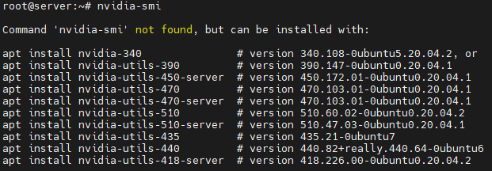
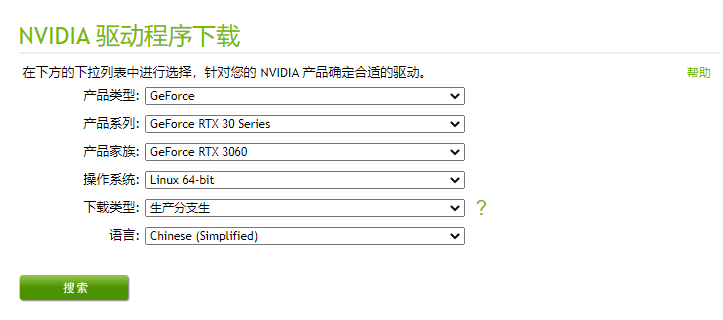
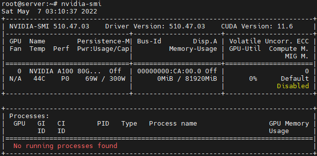
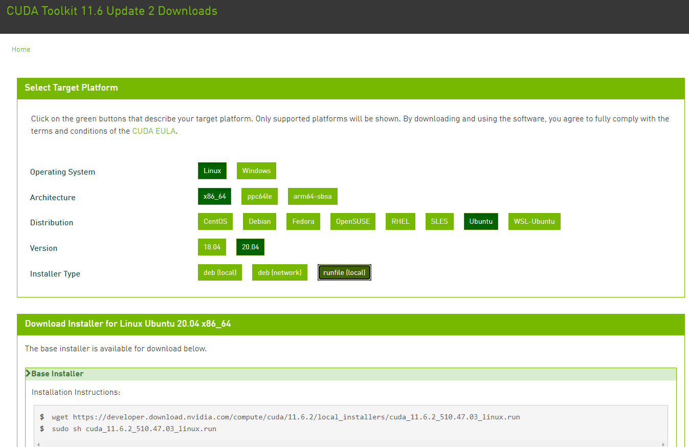
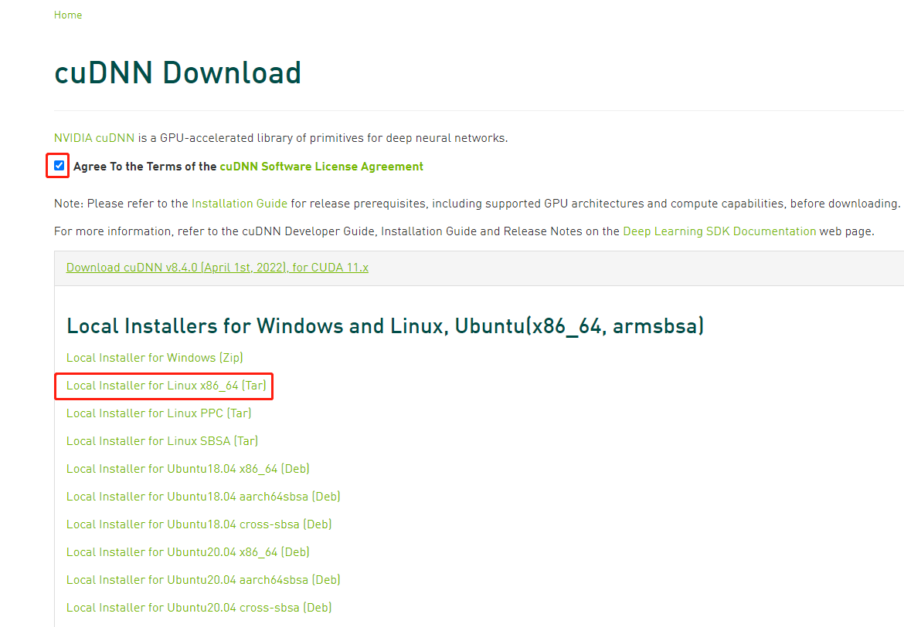

[toc]

# 基于Ubuntu雷达外推项目部署和说明

[](https://res.abeim.cn/api/qq/?qq=489261538) [](https://github.com/AliceEngineerPro) []() []() []() []() []() []()

🚀 **以使用 [Typora](https://typora.io/) 获得更好的预览效果**

🚀 **使用 Visual Studio Code, 推荐插件 [Office Viewer(Markdown Editor)](https://marketplace.visualstudio.com/items?itemName=cweijan.vscode-office)**

✨ **写在前面的话:**

1. **建议先读项目中 [注意事项与维护](# 注意事项与维护) 的章节内容**

2. **阅读代码块请注意注释内容**🔥

3. **文章使用操作系统为 Ubuntu 20.04 LTS (CPU架构: x86_64))**

4. **所有图示GPU信息均为 NVIDIA-Tesla A100 80G**

5. **部署过程涉及网站传送门**

   | 快捷网址(点击即可传送)                                                          |
   | :---------------------------------- |
   | [清华开源软件镜像站](https://mirrors.tuna.tsinghua.edu.cn/)                    |
   | [阿里巴巴开源镜像站](https://developer.aliyun.com/mirror/)                     |
   | [NVIDIA驱动下载官网](https://www.nvidia.cn/Download/index.aspx?lang=cn/)    |
   | [CUDA Toolkit下载官网](https://developer.nvidia.com/cuda-toolkit-archive) |
   | [CUDA驱动下载官网](https://developer.nvidia.com/rdp/cudnn-download/)         |
   | [Anaconda官网](https://www.anaconda.com/products/distribution)          |
   | [PyTorch官网](https://pytorch.org/)                                      |

6. **如有其他问题请及时取得联系**🔥

- 联系方式
   - WeChat: AliceEngineerT
   - E-mail: alice.engineer.pro@outlook.com
   - QQ: 489261538
   - Tel: +86-173-1308-3751
   - Telegram: [@AliceFairy](https://t.me/FairyAlicePro)

# 一. 环境部署

**服务器以`root`用户执行**

## (一). 准备工作

### 1. apt换源

[**清华开源软件镜像站(官网)**](https://mirrors.tuna.tsinghua.edu.cn/); [**清华开源软件镜像站(apt换源帮助)**](https://mirrors.tuna.tsinghua.edu.cn/help/ubuntu/)

### 2. 安装NVIDIA驱动的准备工作

1. 安装lightdm

2. 安装依赖

3. 屏蔽nouveau驱动

   ```shell
   sudo apt-get install lightdm
   sudo apt-get install gcc g++ make
   sudo echo -e "blacklist nouveau\noptions nouveau modeset=0" > /etc/modprobe.d/blacklist-nouveau.conf
   sudo update-initramfs -u
   lsmod | grep nouveau
   ```

4. 屏蔽nouveau驱动
   
   1. 确保选项NVIDIA GPU和PCIe网络适配器与相应的驱动程序通信
   
	  ```shell
	  sudo vim /etc/default/grub
	  ```
   
   2. 在"GRUB_CMDLINE_LINUX_DEFAULT="之后，在引号中添加"pci=realloc=off"，如下所示:
   
	  

5. 更新grub, 后重启

   ```shell
   sudo update-grub
   sudo boot
   ```

## (二). 安装NVIDIA驱动

**安装NVIDIA驱动时, 需要关闭lightdm服务 (需要在命令行安装, 不得在图像化界面安装)**

1. 关闭lightdmf服务, 并确保图像化服务全部停止工作

   ```shell
   sudo /etc/init.d/lightdm stop
   sudo /etc/init.d/lightdm status
   sudo /etc/init.d/gdm3 status
   ps -ef | grep X
   ps -ef | grep gnome
   ```

2. [**NVIDIA驱动安装参考官网**](https://www.nvidia.cn/Download/index.aspx?lang=cn)

   

   

   

   

   

   

3. 验证

```shell
nvidia-smi
```

## (三). 安装CUDA Toolkit

**安装CUDA Toolkit驱动时, 也需要关闭lightdm服务(也需要在命令行安装, 不得在图像化界面安装)**

1. 获取CUDA 版本

   查看显卡驱动对应的cuda版本(右上角CUDA Version版本)

   ```shell
   nvidia-smi
   ```

   

2. 选择对应cuda版本和系统, 按照官网提供的方式安装

   [**官网下载CUDA Toolkit**](https://developer.nvidia.com/cuda-toolkit-archive)

   

3. 添加环境变量

   ```shell
   vim /etc/profile
   
   export PATH=/usr/local/cuda-<cuda version>/bin${PATH:+:${PATH}}  
   export LD_LIBRARY_PATH=/usr/local/cuda-<cuda version>/lib64${LD_LIBRARY_PATH:+:${LD_LIBRARY_PATH}}
   export CUDA_HOME=/usr/local/cuda
   ```

4. 更新环境变量

   ```shell
   source /etc/profile
   ```

5. 验证CUDA是否安装成功

   ```shell
   nvcc -V
   ```

   

## (四). 安装CuDNN

需要NVIDIA的账户(没有的可以免费注册)

1. 查看cuda版本

   ```shell
   # nvcc -V 或 nvidia-smi
   nvcc -V
   nvidia-smi
   ```

2. 获取CuDNN安装包

   [**官网**](https://developer.nvidia.com/rdp/cudnn-download) 下载安装包, 对应cuda版本

   

3. 解压并添加环境变量

   ```shell
   tar -xvJf <CuDNN package name>.tar.xz
   
   sudo cd <CuDNN package name>/
   sudo cp include/cudnn.h /usr/local/cuda/include
   sudo cp include/cudnn_version.h /usr/local/cuda/include
   sudo cp lib64/libcudnn* /usr/local/cuda/lib64
   # 若提示没有lib64的目录, 使用ls看是否有lib的目录, 如果有请执行:
   sudo cp lib/libcudnn* /usr/local/cuda/lib64
   sudo chmod a+r /usr/local/cuda/include/cudnn.h /usr/local/cuda/include/cudnn_version.h /usr/local/cuda/lib64/libcudnn*
   ```

4. 验证

   ```shell
   cat /usr/local/cuda/include/cudnn_version.h | grep CUDNN_MAJOR -A 2
   ```

## (五). 安装Anaconda

1. 下载文件

   ```shell
   # 国内源
   wget https://mirrors.tuna.tsinghua.edu.cn/anaconda/archive/Anaconda3-5.3.1-Linux-x86_64.sh
   # 官方源(建议使用官方源)
   wget https://repo.anaconda.com/archive/Anaconda3-2022.05-Linux-x86_64.sh
   chmod 755 <Anaconda package name>.sh
   ```

2. 安装Anaconda

   ```shell
   # 根据提示按照自己需求安装
   ./<Anaconda Package Name>.sh
   ```

3. Anaconda初始化并添加环境变量

   ```shell
   # 初始化
   <Anaconda installed path>/bin/conda init
   # 添加环境变量(系统变量, root用户变量都可以, 推荐添加至root用户变量)
   echo 'export ANACONDA_HOME=<Anaconda installed path>' >> ~/.bash_profile
   echo 'export PATH=$ANACONDA_HOME/bin:$PATH' >> ~/.bash_profile
   source ~/.bash_profile && source ~/.barchrc
   ```

4. 验证

   ```shell
   conda -V
   ```

5. 激活Anaconda虚拟环境并创建项目所使用的虚拟环境

   ```shell
   # 激活
   conda activate
   # 创建项目虚拟环境
   conda create -n <virtual environment name> python=3.7.9
   # 激活项目虚拟环境
   conda activate <virtual environment name>
   ```

# 二. 项目部署

## (一). 获取pytorch

**在 Anaconda 项目虚拟环境中执行**

1. 获取CUDA版本 (参照 [获取CUDA版本](#3. 安装CUDA Toolkit))
2. 根据CUDA的版本获取 [PyTorch](https://pytorch.org) , 执行 `Run this Command`

   ```shell
   # e.g
   # default
   pip3 install <Package Name> ... <Package Name>
   pip3 install <Package Name> ... <Package Name> --extra-index-url <Url>
   # Tips: 若提示找不到 pip3, 则替换 pip
   pip install <Package Name> ... <Package Name>
   pip install <Package Name> ... <Package Name> --extra-index-url <Url>
   ```

   

**Tips:** 若提示找不到 `pip3` , 则替换 `pip`

## (二). 获取依赖包

**在 Anaconda 项目虚拟环境中执行**

```bash
pip install -r requirements.txt
```

# 三. 项目运行

```bash
cd <program installed path>
# TTY terminal
python run.py
# TTY terminal or ssh terminal
nohup python run.py >> <log path> 2>&1 &
```

**注意事项:**

1. 项目运行时, 当前目录必须是项目的根路径
2. 如果使用脚本启动方式, 请先 `cd` 到项目的根路径再运行, 即:

   ```shell
   # shell script / python script
   ...
   cd <program installed path>
   nohup python run.py >> <log path> 2>&1 &
   ...
   ```

# 四. 注意事项与维护

## (一). 注意事项

1. 操作系统需关闭内核自动更新
2. 服务器可以/bin/bash下正常运行(命令行模式)
3. 若在图形化lightdm下运行, 请关闭 `系统休眠`, `系统睡眠`, `系统待机` 等一切有可能由硬件设备, 操作系统设定所导致服务停止运行的相关设置
4. 项目运行时当前路径必须在项目的根路径下, 即: `$(pwd) = /{ProjectPath}`
5. 输入文件夹只可以用来存放数据(不可存放其他数据)

## (二). 项目维护

1. 该部署方式为基于GPU运行, 确保服务器GPU显存大于8G及以上(项目运行所需显存大于6G)
2. 在部署/运行过程中出现不确定的情况, 根据情况而解决问题
3. 数据在上传的过程中若出现数据时间不连续, 请删除输入文件夹内的数据, 重新启动项目即可
4. 项目运行时, 若出现报错情况, 请根据python的报错情况进行合理解决
   
   - 缺少python的模块包: `pip install <module package name>`
5. 项目每次运行之前, 输出文件若有同一时间的源文件(输入文件), 则需输出文件夹对应源文件(输入文件)同一时间的输出数据文件夹删除即可
6. 项目部署完成后, 服务器硬件信息不可更改(电源, 网卡除外)

# 附1: 服务器配置硬件信息

| 内容        | 配置                                               | 说明                                      |
|-----------|--------------------------------------------------|-----------------------------------------|
| 操作系统      | Ubuntu18.04LTS/RedHat7.2 及以上                     | 安装GNOME管理器(推荐按使用lightdm, 默认GNOME大多为GMD) |
| NVIDIA 显卡 | NVIDIA GeForce RTX 3060(12GB) Consumer Level 及以上 | 安装显卡驱动                                  |
| 内存        | 8GB 及以上                                          | 推荐16GB 及以上                              |
| CPU       | 4 cores, 8 threads, 2.8GHz 及以上                   | 8 cores, 12 threads, 3.2GHz 及以上         |
| 硬盘        | 200G 及以上(操作系统占用除外)                               | 程序运行过程中会产生一些日志(推荐1TB 及以上)               |
| 网卡        | 100Mbps以太网卡 及以上                                  | 推荐1Gbps以太网卡(LAN传输不低于20M/s)              |

## 关于CPU的采购说明

> 由于本项目基于GPU实现功能, 服务器CPU定位在中高端CPU即可, 具体型号, 配置不做详细说明

## 关于硬盘的采购说明

> 排除操作系统占用, 项目包占用后可分配磁盘空间应大于200G即可, 硬盘选购正规大品牌(戴尔, 西数, 三星等), 具体型号, 配置不做详细说明

## 关于NVIDIA显卡采购说明

**GPU为整个项目的核心硬件设备**

> 在采购显卡时需注意:
> 此配置为消费级显示卡, 若在生产中服务器的硬件不支持消费级显示卡, 请置换为同等及以上配置的企业级GPU即可, 具体型号, 配置不做详细说明

## 关于服务器/工作站电源配置说明

> 服务器/工作站电源建议大于服务器硬件功耗的30%, 具体型号, 配置不做详细说明
> e.g:
> CPU功耗: 75W * 2, GPU功耗: 300W * 1
> 建议使用: 75 * 2 + 300 + (75 * 2 + 300) * 0.3 ≈ 600, 即使用600W+的电源

# 附2: Anaconda 相关命令

```bash
# 查看conda版本
conda --version
# 查看conda的环境配置
conda config --show
# 设置conda镜像
#设置清华镜像
conda config --add channels https://mirrors.tuna.tsinghua.edu.cn/anaconda/pkgs/free/
conda config --add channels https://mirrors.tuna.tsinghua.edu.cn/anaconda/pkgs/main/
conda config --add channels https://mirrors.tuna.tsinghua.edu.cn/anaconda/cloud/conda-forge/
conda config --add channels https://mirrors.tuna.tsinghua.edu.cn/anaconda/cloud/bioconda/
#设置bioconda
conda config --add channels bioconda
conda config --add channels conda-forge
#设置搜索时显示通道地址
conda config --set show_channel_urls yes
# 更新conda
conda update conda
# 更新Anaconda整体
conda update Anaconda
# 创建虚拟环境
conda create -n <virtual environment name> python=<python version>
# 克隆一个环境
conda create -n <clone virtual environment name> --clone <virtual environment name>
# 查看虚拟环境
conda env list
conda info -e
conda info --envs
# 激活虚拟环境
conda activate <virtual environment name>
# 退出虚拟环境
#切换到默认环境(base)
conda activate
#退出当前环境
conda deactivate
# 删除虚拟环境
conda remove --name <virtual environment name> --all
# 导出环境
#获得环境中的所有配置
conda env export --name <virtual environment name> > <virtual environment name>.yml
#重新还原环境
conda env create -f <virtual environment name>.yml
# 查询包的安装情况
conda list
# 查询当前Anaconda repository中是否有你想要安装的包
conda search <package name>
# 包的安装和更新
conda install <package name>
# 将某个包更新到它的最新版本
conda update <package name>
# conda卸载包
conda uninstall <package name>
```
